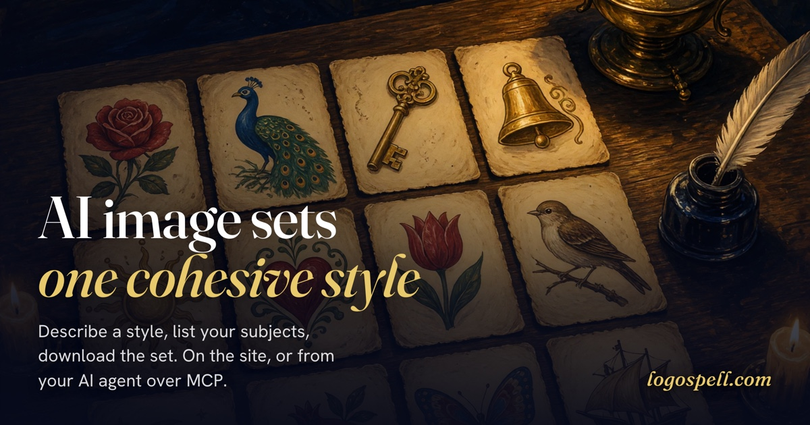

<p align="center">
  
</p>

A travel-agency site, built by an AI agent from one prompt, twice: once
with a paragraph handing the hero, nav icons and posters to Logospell
over MCP, once without.

https://github.com/user-attachments/assets/82fc9f89-3830-41b9-8172-1a1b0731b914

# Setup

1. Sign up at [logospell.com](https://logospell.com): free starter
   credits, no card required.
2. Copy the API key from your account page.
3. Connect your client. Logospell is a hosted MCP server, so there is
   nothing to build or run locally.

More clients, with step-by-step setup: [logospell.com/connect](https://logospell.com/connect)

### Any MCP client

Endpoint: `https://mcp.logospell.com/mcp` (streamable HTTP, bearer API key).

```json
{
  "mcpServers": {
    "logospell": {
      "type": "http",
      "url": "https://mcp.logospell.com/mcp",
      "headers": { "Authorization": "Bearer ls_<your-key>" }
    }
  }
}
```

Agent-assisted setup: see [llms-install.md](llms-install.md).

### Claude Code

```
/plugin marketplace add logospell/logospell-mcp-server
/plugin install logospell@logospell
```

Claude Code asks for your API key when it enables the plugin.

### Grok Build

```
grok plugin install logospell/logospell-mcp-server --trust
```

Then set `LOGOSPELL_API_KEY` in your environment.

### Cursor

Save the `mcp.json` from the Cursor tab at
[logospell.com/connect](https://logospell.com/connect). Signed in, it
has your key filled in.

### Gemini CLI

```
gemini extensions install https://github.com/logospell/logospell-mcp-server
```

Gemini CLI asks for your API key when it installs the extension.

<br>

# MCP Tools

### `generate_image_set` · 1 credit

A cohesive set of images on a solid background, such as icons, game assets or UI elements. You set the style (in words, with reference images, or both), the background color, an exact size or native resolution, how each subject fills its frame, the margin, the format and quality, and each file's name. A finished set can be re-cut with [`edit_image_set`](#edit_image_set--free), or exported as web, iOS, Android and Flutter icons with [`export_icons`](#export_icons--free).

<table>
  <tr>
    <th colspan="3" align="left">Your agent asks for</th>
  </tr>
  <tr>
    <td colspan="3"><samp><b>style</b></samp><br>American traditional tattoo flash: bold black outlines, flat saturated red, green, yellow and blue, simple black shading<br><br><samp><b>subjects</b></samp><ul><li>a swallow in flight</li><li>an anchor wrapped in rope</li><li>a red rose</li><li>a clipper ship under full sail</li><li>a panther head</li><li>a pocket watch</li><li>a lighthouse</li><li>a spread-winged eagle</li><li>a lucky horseshoe</li></ul><samp><b>background</b></samp><br>#E4D0A6<br><br><samp><b>width</b></samp><br>256<br><br><samp><b>height</b></samp><br>256<br><br><samp><b>sizing</b></samp><br>relative<br><br><samp><b>minimumMargin</b></samp><br>10</td>
  </tr>
  <tr>
    <th colspan="3" align="left">Your agent receives</th>
  </tr>
  <tr>
    <td align="center"></td>
    <td align="center"></td>
    <td align="center"></td>
  </tr>
  <tr>
    <td align="center"></td>
    <td align="center"></td>
    <td align="center"></td>
  </tr>
  <tr>
    <td align="center"></td>
    <td align="center"></td>
    <td align="center"></td>
  </tr>
</table>

<br>

### `generate_transparent_image_set` · 1 credit

The same kind of set with transparent backgrounds, ready to drop onto any backdrop, with the same size, sizing and format controls. [`edit_image_set`](#edit_image_set--free) can later lay a finished set onto a background color.

<table>
  <tr>
    <th colspan="3" align="left">Your agent asks for</th>
  </tr>
  <tr>
    <td colspan="3"><samp><b>style</b></samp><br>Venetian millefiori glass mosaic: subjects assembled from tightly packed slices of glass cane, each disc bearing its own tiny star, rosette, or concentric ring pattern, in luminous ruby, cobalt, amber, jade, and violet, glassy polished sheen, fine dark seams between the discs<br><br><samp><b>subjects</b></samp><ul><li>a tortoise with a domed shell</li><li>a fox with a sweeping tail</li><li>a koi fish mid-leap</li><li>a dragonfly with double wings</li><li>a toucan with an oversized beak</li><li>a rabbit sitting upright with ears tall</li><li>a cactus in a patterned pot</li><li>a mermaid with a curled tail</li><li>a peacock with its tail fanned</li></ul><samp><b>background</b></samp><br>transparent (always; this tool has no background parameter)<br><br><samp><b>width</b></samp><br>256<br><br><samp><b>height</b></samp><br>256<br><br><samp><b>sizing</b></samp><br>relative<br><br><samp><b>minimumMargin</b></samp><br>10</td>
  </tr>
  <tr>
    <th colspan="3" align="left">Your agent receives</th>
  </tr>
  <tr>
    <td align="center"></td>
    <td align="center"></td>
    <td align="center"></td>
  </tr>
  <tr>
    <td align="center"></td>
    <td align="center"></td>
    <td align="center"></td>
  </tr>
  <tr>
    <td align="center"></td>
    <td align="center"></td>
    <td align="center"></td>
  </tr>
</table>

<br>

### `generate_illustration` · 1 credit

One composed picture, such as a scene, hero image, banner or portrait, in a wide range of aspect ratios, as PNG, JPEG or WebP at the quality you choose. Each ratio's sizes are exact halves of one another, so this 1584x672 picture displays crisply at 792x336.

<table>
  <tr>
    <th align="left">Your agent asks for</th>
  </tr>
  <tr>
    <td><samp><b>prompt</b></samp><br>A small brass-and-glass airship moored to a clifftop lighthouse at sunset: the keeper waves from the railed gallery, gulls wheel overhead, and warm amber light spills across a calm sea far below. Painterly storybook illustration, rich and detailed, luminous golden-hour palette<br><br><samp><b>width</b></samp><br>1584<br><br><samp><b>height</b></samp><br>672</td>
  </tr>
  <tr>
    <th align="left">Your agent receives</th>
  </tr>
  <tr>
    <td align="center"></td>
  </tr>
</table>

<br>

### `create_reference` · free

Create an upload slot for a style reference image: you get back a
ref_ token and a one-line curl upload command. To extend one of your
own recent sets, skip the upload: pass `sourceGeneration` and
`sourceImage` and the server copies that image in, and the batch you
make with it joins that set and restarts its download window. Both
set tools accept up to 3 tokens via styleReferences; alone or
alongside the style text, the references define the style by
example, the tightest way to extend an existing set in its original
look.

<br>

### `list_references` · free

List your live reference images, most recently used or uploaded first, with each one's `ref` token, upload URL and expiry, to recover a token you lost instead of uploading the image again.

<br>

### `check_credits` · free

Check how many image generation credits remain on your account: one
balance shared by your MCP calls and the logospell.com generate page.

<br>

### `buy_credits` · no charge to call

Get a Stripe Checkout link that buys 1 to 10 credit packs (`packs`,
default 1) for the account your API key belongs to, with no sign-in.
Open it, or hand it to your user, to pay with a card or Link; the
credits land on the key within seconds of payment.

<br>

### `list_recent_generations` · free

List your recent generations, a page at a time, and get their download
URLs again, for example to recover a result lost to a dropped
connection. Generations made on the generate page at logospell.com
appear here too.

<br>

### `get_generations` · free

Get the full record of generations whose ids you have: download link and expiry, current delivery settings, style references, and the prompt.json whose style and subjects are the original call's, so a set can be extended or reproduced. Takes a `generations` list of ids.

<br>

### `edit_image_set` · free

Change how an existing image set is delivered without generating again: `width` and `height` (both, one, or neither, as on the set tools), `canvas` (with no size fixed: `uniform` for one canvas across the set, `subject` to wrap each image around its own subject), `minimumMargin`, `sizing` (relative or fill), `format` and `quality`, and for a transparent set `background` (a `#RRGGBB` color to compose over, or `"transparent"`), or `reset` to return to the set as it was first delivered. Takes the set's `generation` id; a lever left out keeps its current value. The set's download is replaced in place, so the same URL serves the new delivery. Style, subjects and references cannot be edited.

<br>

### `export_icons` · free

Export an existing image set as icons for the web, iOS, Android and Flutter at the base size `iconSize` you name (an even number, 16 to 256; it sizes the batch, so every icon is the delivered image scaled and no file exceeds it): every subject at every density each platform needs, laid out as each expects, with a viewer and a ledger that says per tree whether any file has some blur. One batch and one size per call; `format` and `quality` default to the set's current ones.

<br>

### `delete_generations` · free

Permanently delete one or more of your generations before their download window closes: each download URL stops working, and the images and the source kept for edits and icon exports are removed. Takes a `generations` list of ids; pass all of a set's ids to delete the whole set. Only the API key that made a generation can delete it; there is no undo, and credits are not refunded.

<br>

### `delete_references` · free

Permanently delete one or more references you created with [`create_reference`](#create_reference--free), before they expire on their own: pass their tokens in `refs`, and the images are removed and the tokens stop working. Only the API key that created a reference can delete it.

<br>

# Network and credentials

Logospell's plugins talk only to `mcp.logospell.com`: the MCP endpoint
(`https://mcp.logospell.com/mcp`) plus the time-limited download URLs
its results return on the same host. They authenticate with your
`LOGOSPELL_API_KEY` as a bearer token, sent only there. No third-party
endpoints, no client-side telemetry; service calls are recorded
server-side as described in the privacy policy.

<br>

<p align="center"><a href="https://logospell.com/docs">Docs</a> · <a href="https://logospell.com/privacy">Privacy</a> · <a href="mailto:support@logospell.com">Support</a> · <a href="https://registry.modelcontextprotocol.io/?q=com.logospell">MCP Registry</a></p>

<p align="center"><a href="https://glama.ai/mcp/connectors/com.logospell/logospell"></a></p>
